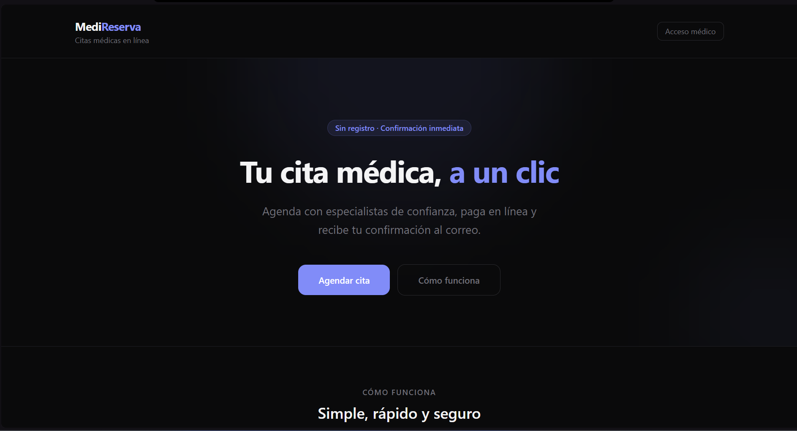

# MediReserva

Medical appointment booking system with online payments and calendar integration.

[](https://github.com/juan888420/Reservas-project/actions/workflows/ci.yml)


MediReserva lets patients pick a doctor, an available time slot, and pay online to confirm an appointment. Doctors log in to a private panel to see their confirmed schedule. Built on Next.js App Router with Supabase as the backend (Postgres + Auth + RLS) and PayPal for payments.

**Live demo:** [reservas-project-production.up.railway.app](https://reservas-project-production.up.railway.app/)



## Table of Contents

- [Features](#features)
- [Tech Stack](#tech-stack)
- [Installation](#installation)
- [Usage](#usage)
- [Environment Variables](#environment-variables)
- [Project Structure](#project-structure)
- [Backend (Supabase)](#backend-supabase)
- [License](#license)

## Features

- Slot-based booking flow: doctor -> date -> time, with already-booked slots disabled
- Online payment via PayPal Sandbox, with webhook-confirmed appointments
- Automatic confirmation email (Resend) with a Google Calendar link
- Doctor panel with Supabase Auth login to view only their own confirmed appointments
- Race-condition-safe booking backed by Postgres RPCs (`FOR UPDATE SKIP LOCKED`, idempotent confirmation)
- Rate limiting on API routes via Upstash Redis
- Request validation with Zod on API endpoints

## Tech Stack

- **Framework:** Next.js 16 (App Router, TypeScript)
- **Styling:** Tailwind CSS v4
- **Database & Auth:** Supabase (PostgreSQL + Auth, Row Level Security)
- **Payments:** PayPal Sandbox
- **Email:** Resend
- **Rate limiting:** Upstash Redis
- **Validation:** Zod
- **Testing:** Playwright (API + E2E)

## Installation

1. Clone the repository and install dependencies:

   ```bash
   npm install
   ```

2. Copy the environment file and fill in your credentials:

   ```bash
   cp .env.example .env.local
   ```

3. Set up the Supabase project (see [Backend](#backend-supabase) below).

4. Run the dev server:

   ```bash
   npm run dev
   ```

   Open [http://localhost:3000](http://localhost:3000).

## Usage

### Patient flow (`/` -> `/reservar`)

1. Choose a doctor, date, and time (booked slots are disabled)
2. Enter name, email, and reason for the visit
3. Pay with PayPal
4. Receive a confirmation email with a Google Calendar link

### Webhook (`/api/webhook`)

On payment confirmation:

- Marks the appointment as `confirmada`
- Marks the slot as `disponible = false`
- Sends the confirmation email via Resend

### Doctor flow (`/medico/login` -> `/medico/panel`)

- Logs in with Supabase Auth
- Views confirmed appointments (patient, reason, date/time)

Run tests with:

```bash
npm run test        # all Playwright tests
npm run test:api    # API tests only
npm run test:e2e    # E2E tests only
npm run test:ui     # interactive Playwright UI
```

## Environment Variables

| Variable | Description |
|---|---|
| `NEXT_PUBLIC_SUPABASE_URL` | Supabase project URL |
| `NEXT_PUBLIC_SUPABASE_ANON_KEY` | Supabase public (anon) key |
| `SUPABASE_SERVICE_ROLE_KEY` | Supabase service role key (server only) |
| `PAYPAL_MODE` | `sandbox` or `live` (defaults to sandbox if unset) |
| `NEXT_PUBLIC_PAYPAL_CLIENT_ID` | PayPal Client ID |
| `PAYPAL_CLIENT_SECRET` | PayPal Client Secret |
| `PAYPAL_WEBHOOK_ID` | Webhook ID registered in PayPal |
| `RESEND_API_KEY` | Resend API key |
| `RESEND_FROM_EMAIL` | Verified sender email in Resend |
| `NEXT_PUBLIC_APP_URL` | Public app URL (e.g. `http://localhost:3000`) |
| `UPSTASH_REDIS_REST_URL` | Upstash Redis REST URL (rate limiting) |
| `UPSTASH_REDIS_REST_TOKEN` | Upstash Redis REST token (rate limiting) |

## Project Structure

```
src/
  app/
    api/
      auth/            # Auth-related endpoints
      citas/           # Appointment endpoints
      google-calendar/ # Calendar link generation
      medicos/         # Doctors (public read)
      paypal/          # Payment order handling
      slots/           # Slot availability
      webhook/         # PayPal payment confirmation webhook
    medico/
      login/           # Doctor login
      panel/           # Doctor panel (protected)
    reservar/           # Patient booking flow
  components/
  lib/
    supabase/           # Supabase clients (browser/server)
supabase/
  schema.sql             # Database schema
  seed.sql                # Seed data
  migrations/
tests/                     # Playwright API/E2E tests
```

## Backend (Supabase)

### Setup

```bash
# Option A: SQL Editor (production)
# Run in order: schema.sql -> seed.sql

# Option B: Supabase CLI (local)
supabase start
supabase db reset   # applies schema + seed if placed under migrations/
```

After running the schema, create a doctor user in **Authentication -> Users** (email + password) and link it:

```sql
UPDATE medicos SET auth_user_id = 'AUTH-USER-UUID'
WHERE id = 'a0000000-0000-4000-8000-000000000001';
```

### Access layers

| Role | Purpose | Usage |
|---|---|---|
| `anon` | Public read | GET `/api/medicos`, GET `/api/slots` (RLS-enforced) |
| `authenticated` | Logged-in doctor | Panel reads only their own appointments via RLS |
| `service_role` | Server-side API | Creates/confirms appointments via RPC (never on the client) |

### RPC functions (atomic transactions)

- `crear_cita_pendiente` locks the slot with `FOR UPDATE SKIP LOCKED` to prevent double booking
- `confirmar_cita_db` confirms the appointment and occupies the slot in a single, idempotent transaction
- `actualizar_paypal_order_id` associates a PayPal order with the appointment

### Applied best practices

- RLS enforced on every table, with `(SELECT auth.uid())` in policies
- Partial indexes on available slots and pending/confirmed appointments, and on PayPal IDs
- Unique partial index enforcing a single active appointment per slot
- Indexed foreign keys (`slots.medico_id`, `citas.slot_id`)
- Constraints on email format, positive rate/amount, and allowed status values
- Least-privilege grants: `anon` can only `SELECT` on `medicos`/`slots`; writes go through RPC + `service_role`

### Tables

- **medicos**: name, specialty, rate, `auth_user_id`
- **slots**: `medico_id`, date, time, availability
- **citas**: `slot_id`, patient name, email, reason, amount, status

## License

MIT. See [LICENSE](./LICENSE).
